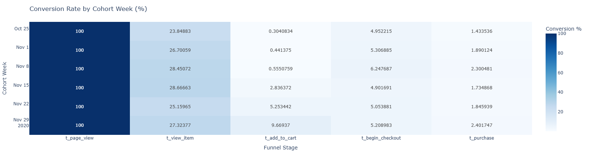
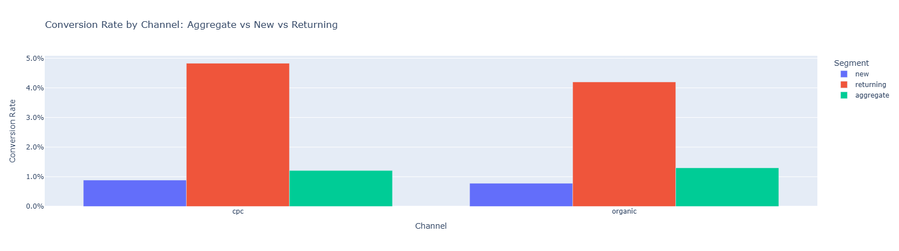
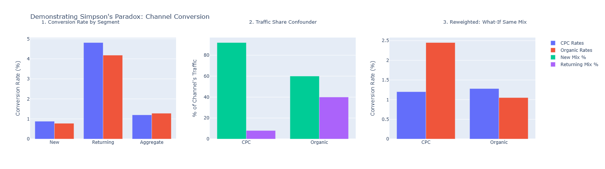
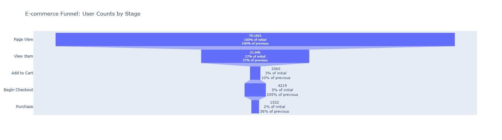
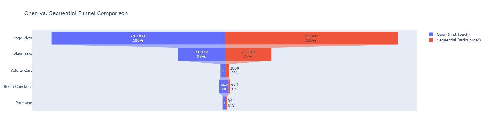

# E-commerce Signup-to-Purchase Funnel Analysis

A funnel analysis project built on Google Analytics 4 e-commerce event data, using BigQuery for extraction and Python for analysis. The project set out to measure conversion through a standard funnel and ended up surfacing a real instrumentation problem in the underlying tracking data, which became the main finding.

## Problem Statement

Online retailers track users through a funnel of stages, from browsing a page to completing a purchase, in order to identify where potential customers drop off. This project analyzes one month of GA4 event data (November 2020) from the public `bigquery-public-data.ga4_obfuscated_sample_ecommerce` dataset to answer:

1. What does the conversion rate look like at each stage of the funnel?
2. Where is the biggest drop off, and is it a genuine user behavior pattern or a data quality issue?
3. How much does the funnel change once we enforce a strict, logically ordered path through the stages rather than just checking whether each stage occurred at some point?

## Funnel Stages

`page_view` → `view_item` → `add_to_cart` → `begin_checkout` → `purchase`

## Data Source

- Dataset: `bigquery-public-data.ga4_obfuscated_sample_ecommerce`
- Access: Google Cloud BigQuery Sandbox mode (no billing required, 1TB free query processing per month)
- Date range: November 1 to November 30, 2020
- Tables are date sharded (`events_YYYYMMDD`), queried with `_TABLE_SUFFIX` filtering for cost control and partition pruning

## Methodology

**1. First touch extraction (SQL, BigQuery)**
Extracted the earliest timestamp per user per funnel stage into a single wide table (`funnel_first_touch`), one row per `user_pseudo_id` with a nullable timestamp column for each stage. This is the simplest and most common way to build a funnel table, but it has a blind spot: it only checks whether a stage happened at some point, not whether the stages happened in the correct order.

**2. Conversion rate calculation (Python, pandas)**
Computed overall and step by step conversion rates from the first touch table.

**3. Sequential funnel validation (SQL, BigQuery)**
Because the first touch numbers looked suspicious (see Key Finding below), a second table (`funnel_sequential`) was built that enforces strict path order using cascading `CASE WHEN` logic, where each stage timestamp only counts if it is later than the previous validated stage. This produces a closed funnel where a user must have genuinely passed through every prior stage, in order, to count at a given stage.

**4. Cohort analysis (Python, pandas)**
Users were grouped into weekly cohorts by the week of their first page view, then conversion rate at each funnel stage was computed per cohort. This is what surfaced the instrumentation drift pattern described in the Key Finding.

**5. Segmentation analysis (Python, pandas)**
Conversion was broken down by acquisition channel and by new versus returning user status, which surfaced a Simpson's paradox between channel and user type. See Segmentation Analysis below.

**6. Survival analysis (Python, lifelines, in progress)**
Sequential timestamps for users who reached `add_to_cart` (1,850 users) have been pulled into a notebook as the first step toward a Weibull AFT model of time from `add_to_cart` to `purchase`, with right censoring for users who never converted. The model itself has not been fit yet.

## Key Finding: Funnel Inversion from Instrumentation Drift

The first touch funnel showed something that should not be possible: 75 percent of users who reached `begin_checkout` (3,164 out of 4,219) had no `add_to_cart` event logged at all, producing a step conversion rate over 100 percent between those two stages.

Two hypotheses were tested and ruled out or confirmed:

- **Device/platform tracking gap (ruled out):** Split by `device.category` to check whether mobile in-app browsers (e.g. ads opened from Instagram or TikTok) were failing to fire the `add_to_cart` tag. Conversion was nearly identical across device types (desktop 49.2 percent, mobile 48.4 percent, tablet 45.0 percent), so this was not the explanation.
- **Instrumentation drift over time (confirmed):** Breaking conversion down by weekly cohort showed `add_to_cart` conversion climbing steadily across November, from 0.3 percent in the first week to 9.7 percent by the end of the month, while `purchase` conversion stayed roughly flat between 1.4 and 2.4 percent. In the earliest cohorts, the purchase rate was actually higher than the add to cart rate, which is logically impossible in a real funnel. This points to the `add_to_cart` event not being logged correctly for part of the month, with logging improving partway through November.

The sequential funnel table confirms this diagnosis. Enforcing strict stage order collapses the funnel dramatically at exactly the stages downstream of the broken event:

| Stage | Open funnel (first touch) | Sequential funnel (strict order) | Change |
|---|---|---|---|
| page_view | 79,181 | 79,181 | 0 percent |
| view_item | 21,440 | 21,316 | -0.6 percent |
| add_to_cart | 2,060 | 1,850 | -10 percent |
| begin_checkout | 4,219 | 694 | -83.5 percent |
| purchase | 1,532 | 344 | -77.5 percent |

The huge collapse at `begin_checkout` and `purchase` under strict ordering is strong corroborating evidence that most of the "extra" checkout and purchase events in the open funnel belong to users whose `add_to_cart` event simply never fired, rather than to a real buy-without-cart user behavior.

**Takeaway:** the raw open funnel massively overstates checkout and purchase conversion because it does not require stages to occur in order. Any funnel metric derived from this dataset should use the sequential, order-enforced table, and any real-world equivalent of this project should treat this as a flag to check event instrumentation before trusting funnel conversion numbers at face value.

## Other Data Quality Notes

- The weekly cohorts at the edges of the date range (week of October 26 and week of November 30) are partial weeks, since the underlying data only covers November 1 through 30. They are flagged in the analysis rather than excluded, since excluding them silently could hide the boundary effect.

## Cohort Analysis



Weekly cohort table showing conversion rate at each funnel stage, split by the week a user's first page view occurred. This is the same breakdown used to diagnose the instrumentation drift above: `add_to_cart` conversion rises steadily from 0.3 percent in the earliest cohort to 9.7 percent by the last full week, while `purchase` conversion stays roughly flat throughout at 1.4 to 2.4 percent, confirming that the shift is a tracking artifact rather than a real change in user behavior.

## Segmentation Analysis and Simpson's Paradox




Conversion was broken down by acquisition channel and by new versus returning user status. Looking only at the aggregate numbers, organic traffic converts slightly better than CPC (paid search): 1.30 percent versus 1.21 percent.

Splitting by user type reverses that conclusion. CPC actually converts better than organic in both segments:

| Segment | CPC | Organic |
|---|---|---|
| New users | 0.89 percent | 0.78 percent |
| Returning users | 4.83 percent | 4.20 percent |
| Aggregate | 1.21 percent | 1.30 percent |

This is a textbook Simpson's paradox. The reversal happens because the two channels bring in very different mixes of new versus returning users: about 40 percent of organic traffic is returning users, who convert far better than new users, compared to only around 8 percent of CPC traffic. Organic's aggregate number is inflated by a more favorable traffic mix, not by converting visitors more effectively. Reweighting both channels to the same new/returning mix confirms it: with the mix held constant, CPC comes out ahead of organic.

**Takeaway:** channel performance should always be compared within a fixed user type segment, not on the aggregate rate alone, since traffic mix differences between channels can hide or invert the real picture.

## Visuals





Side by side comparison of the open (first touch) funnel versus the sequential, order enforced funnel, illustrating the collapse at begin_checkout and purchase described above.

Cohort and segmentation visuals are shown in their own sections below. A Sankey diagram and dashboard screenshots will be added here once the Streamlit dashboard is built, see Future Scope.

## Repository Structure

```
funnel-analysis-project/
├── README.md
├── sql/
│   ├── 01_first_touch_extraction.sql
│   └── 02_sequential_funnel.sql
├── notebooks/
│   ├── 01_conversion_rates.ipynb
│   ├── 02_cohort_analysis.ipynb
│   ├── 03_segmentation_analysis.ipynb
│   └── 04_survival_analysis.ipynb
├── dashboard/
│   └── (planned, see Future Scope)
├── images/
│   ├── useer_counts_by_stage_funnel
│   ├── open_vs_sequential_funnel_comparision
│   ├── chohort_analysis_conversion_rates_heatmap
│   ├── conversion_rate_by_channel
│   └── demostrating_simpsons_paradox
└── requirements.txt
```

## Tools Used

- Google Cloud BigQuery (Sandbox mode)
- Python: pandas, google-cloud-bigquery, plotly, lifelines
- Jupyter notebooks (via VS Code)

## Status: Actively In Progress

This project is a work in progress and being built incrementally as a portfolio piece. Completed so far:

- [x] BigQuery sandbox project set up
- [x] First touch funnel extraction query
- [x] Conversion rate calculation
- [x] Funnel inversion diagnosed and root caused
- [x] Sequential/order enforced funnel built and compared against the open funnel
- [x] Weekly cohort analysis
- [x] Segmentation analysis by channel and user type, Simpson's paradox identified
- [ ] Survival analysis (data loaded, Weibull AFT model not yet fit)
- [ ] Streamlit dashboard

## Future Scope

- **Survival analysis:** finish fitting the Weibull AFT model (via `lifelines`) on time from `add_to_cart` to `purchase`, right censoring users who never converted, on top of the sequential timestamps already pulled
- **Interactive dashboard:** Streamlit app with a funnel bar chart, a Sankey diagram of user paths, the cohort heatmap, and segment filters, deployed on Streamlit Community Cloud
- **Stretch goal:** an XGBoost classifier predicting checkout drop off, with SHAP based feature importance to explain which factors drive the prediction

## Caveats

- The first touch approach assumes a linear progression through stages and, before the sequential table was built, did not verify that earlier stages actually preceded later ones for a given user. This is the core issue investigated and addressed above.
- Aggregate conversion numbers can hide segment level reversals, which the planned segmentation step is designed to check for directly.
